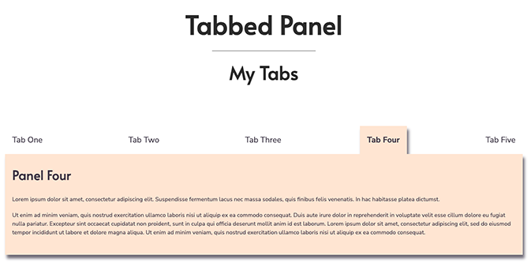

# Tabbed Panel
This project features a collection of tabs and associated content panels. The tabs are clickable which enables users to navigate between the panels and their contents. Built with vanilla JavaScript, HTML5, CSS3, and Flexbox.

## About
The Tabbed Panel displays contents in an interactive manner while taking up limited space on the web page. Each of the project’s panels contains different content, and the content of each panel is reflected in its tab label. 

The tabs are clickable and enable users to easily navigate to the content they are interested in. All tabs remain visible at all times, but only one panel - the one associated with the tab clicked on by the user - is showing at a time. 

## Project Background
I created the tabbed panel as a personal project to practice:

- code organization and data flow, and 
- how to achieve the desired functionality with basic HTML, CSS, and JavaScript.   

To connect the tabs with their associated content panels, the project utilizes HTML href and id attribute values assigned to the tabs and panels. Using JavaScript, the script accesses and stores the values as object properties for further handling and updating of the user interface.  

Main features of the Tabbed Panel project:

- HTML id and href attribute values are used to connect each tab with its content panel and apply styling to display or hide panels and update the user interface to reflect the user’s selection. 

- The tabs each have an id attribute and a link with an href attribute value. Each panel is assigned an id attribute whose value matches the associated tab’s href value.  

- On page load, the script stores each tab’s id attribute value and href attribute value as property key-value pairs in a ‘tab set’ object. 

- — The script uses the id and href attribute values in the ‘tab set’ object to get the first (i.e. default) tab along with the name of the tab’s associated panel. Subsequently, the matching panel is identified and styling is applied to display the default tab and panel set when the page loads.

- When the user clicks on a tab, the script prevents default link behavior and retrieves the tab’s id attribute value via the event object. The tab’s id attribute value is used to identify the name of (and later get) the matching panel in the ‘tab set’ object. Then styling is applied to hide all tab-panel sets, save for the set that was selected by the user.  

- The Tabbed Panel script applies the Model-View-Controller pattern to organize the script and to separate and execute tasks.

## Built With 
- JavaScript
- HTML5 
- CSS3 
- Flexbox

## Launch
[See the live version of the Tabbed Panel here.](https://lonemortensen.github.io/tab-panel/)